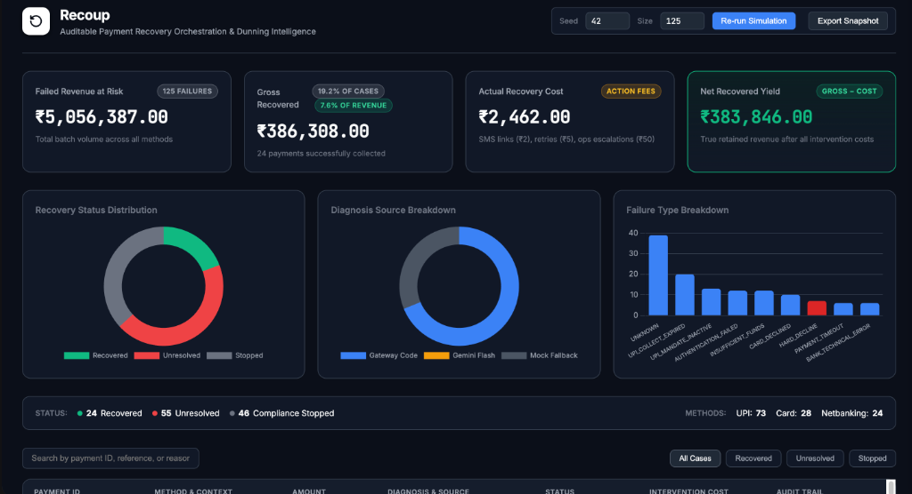

<h1 align="center">
  <br>
  <a href="http://localhost:8080"><svg xmlns="http://www.w3.org/2000/svg" width="64" height="64" viewBox="0 0 24 24" fill="none" stroke="currentColor" stroke-width="2.5" stroke-linecap="round" stroke-linejoin="round"><path d="M3 12a9 9 0 1 0 9-9 9.75 9.75 0 0 0-6.74 2.74L3 8"/><path d="M3 3v5h5"/></svg></a>
  <br>
  Recoup
  <br>
</h1>

<h4 align="center">Auditable payment recovery orchestration & dunning intelligence.</h4>

<p align="center">
  <a href="https://github.com/anshagarwxl/Recoup/actions/workflows/build.yml">
    
  </a>
  <a href="https://recoup-production-89d9.up.railway.app">
    
  </a>
  <a href="https://img.shields.io/badge/Java-21-orange.svg">
    
  </a>
  <a href="https://img.shields.io/badge/Spring%20Boot-3.3.8-brightgreen.svg">
    
  </a>
  <a href="https://img.shields.io/badge/Razorpay-Track_03-blue.svg">
    
  </a>
</p>

<p align="center">
  <a href="#-quick-start">Quick Start</a> •
  <a href="#-architecture--data-flow">Architecture</a> •
  <a href="#-key-features">Key Features</a> •
  <a href="#-demo-video">Demo Video</a>
</p>

---

 

**Recoup** is an auditable recovery orchestration system for batches of failed or at-risk payments, built for the **Razorpay AI Buildathon — Track 03: AI Revenue Recovery**. It diagnoses payment failures, applies deterministic and compliant recovery policies, simulates bounded recovery actions, and reports net recovered revenue with a transaction-level audit trail.

## Quick Start

Get the application running locally in three steps:

```bash
# 1. Clone the repository
git clone https://github.com/anshagarwxl/Recoup.git
cd Recoup

# 2. Set your Gemini API Key (Required for AI classification)
# Create a local properties file (this file is gitignored)
echo "GEMINI_API_KEY=your_api_key_here" > src/main/resources/application.properties

# 3. Run the Spring Boot application
./mvnw clean spring-boot:run
```
Then open [http://localhost:8080](http://localhost:8080) to view the dashboard.

## 🚀 Live Demo

**[https://recoup-production-89d9.up.railway.app](https://recoup-production-89d9.up.railway.app)**

Deployed on Railway. The live instance runs with full Gemini Flash AI classification enabled.

## Demo Video

> **[Insert Link to ~5-minute Demo Video Here]**

*(Note: Watch the video to see the live Gemini Flash AI classification and the dynamic timeline drawer in action).*

## ⚠️ Note on Gemini API Free Tier Limits
The application uses Google's Free Tier Gemini API, which has strict rate limits (e.g., 15 requests per minute, and a tight daily quota). 
- To prevent rate-limit flooding on startup, the application features a **client-side rate limiter** that caps Gemini calls to 3 per batch.
- If the API key is missing, invalid, or the quota is exhausted, the application will **not crash**. It will gracefully degrade, classifying remaining ambiguous failures as `UNKNOWN` with a source tag of `MOCK_FALLBACK`.

## Architecture & Data Flow: The Deterministic Firewall

A common trap in AI finance tools is letting an LLM make routing or financial decisions. LLMs are probabilistic; they will eventually hallucinate a refund, waive a fee, or retry a dead card if given control flow over money. **Recoup explicitly quarantines the AI.**

1. **Synthetic Generation:** A deterministic engine seeds a reproducible batch of 125 failed payments (UPI, Card, Netbanking) representing real-world Indian fintech failures.
2. **Diagnosis (`GATEWAY_CODE` vs `LLM_GEMINI`):** 
   - **Deterministic:** Gateway error codes (e.g., `INSUFFICIENT_FUNDS`, `FRAUD_FLAGGED`) are mapped deterministically.
   - **AI Classification:** Ambiguous, free-text gateway reason strings are sent to Gemini Flash for intelligent classification. If Gemini hallucinates or the API fails, it safely defaults to `UNKNOWN` (`MOCK_FALLBACK`). **The AI is strictly read-only.**
3. **Policy Engine (Zero LLM):** Fully deterministic. It applies compliance rules (e.g., hard halts on fraud) and escalating cost policies (e.g., triggering account manager review for failures > ₹10,000) using strict Java rules. The AI never touches the ledger.
4. **Execution & Auditing:** The Orchestrator logs every decision, simulated cost, and final state to a transparent audit trail, viewable in the Thymeleaf web dashboard.

## Key Features

- **Defense in Depth:** The architecture is built on the assumption that AI can and will fail. Deterministic guardrails ensure that financial stopping conditions (like `HARD_DECLINE`) are never overridden by an LLM.
- **UPI-Aware by Design:** Payment failure handling reflects Indian payment realities rather than treating every failure as a generic card decline.
- **Auditable Decisions:** Every diagnosis, decision, action, and outcome provides a human-readable explanation in the dashboard timeline.
- **Honest Recovery Metrics:** Reports *net* revenue recovered after subtracting retry, messaging, and operational escalation costs.
- **Offline-Safe Dashboard:** The dashboard features Chart.js data visualizations with local fallbacks, tactile button physics, and native `@media print` CSS for exporting clean PDF snapshots.

## Documentation

- [Problem framing](docs/PROBLEM.md)
- [Architecture](docs/ARCHITECTURE.md)
- [Engineering decisions](docs/DECISIONS.md)
- [Data methodology](docs/DATA.md)
- [Recovery data schema](docs/RECOVERY-DATA-SCHEMA.md)
- [Failures and fixes](docs/FAILURES.md)

## Local Development

Run the web server:
```bash
./mvnw spring-boot:run
```

Run the test suite (25 automated tests):
```bash
./mvnw clean test
```
